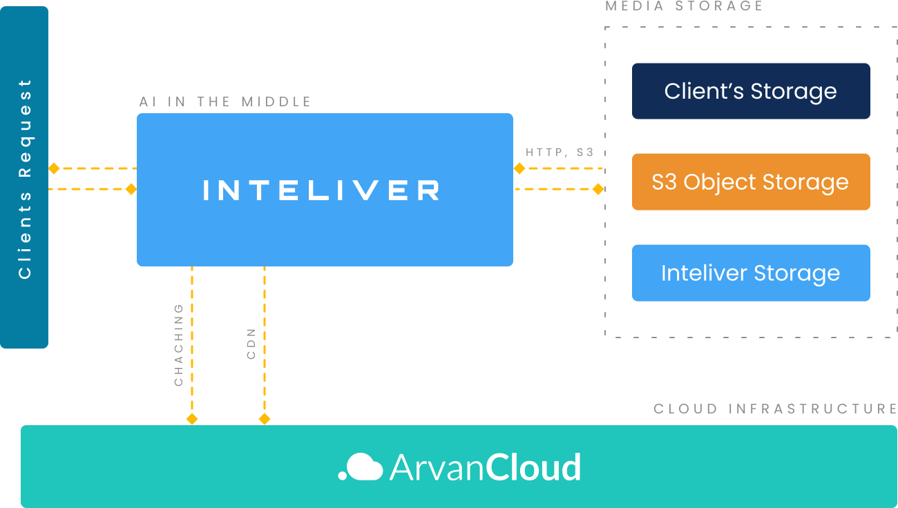
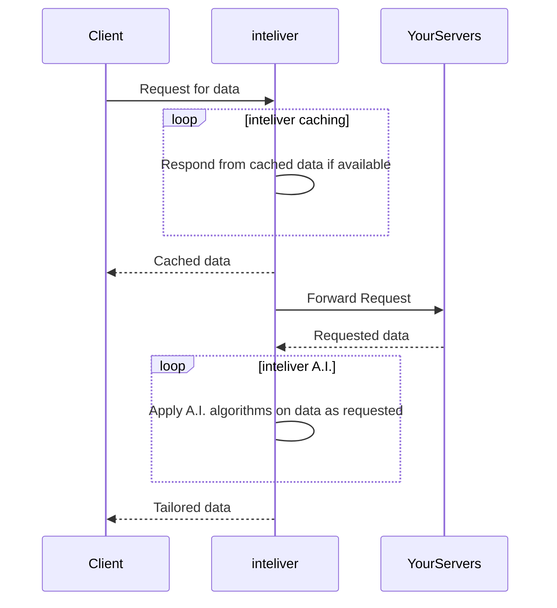

# Architecture

This page provides a detailed explanation of the overall architecture of inteliver, using a sequence diagram to illustrate the flow of data and operations within the system.

<!-- 

 -->

<figure markdown="span">
  
  <figcaption>inteliver Architecture Birdview</figcaption>
</figure>

## inteliver Data Flow Diagram

## Diagram Explanation
The sequence diagram above illustrates the interactions between the Client, inteliver, and YourServers. Here is a step-by-step explanation of the processes depicted in the diagram:

### 1. Client Requests Data

The process begins with the Client sending a request for data to the inteliver platform.

### 2. inteliver Caching

Upon receiving the request, inteliver first checks its cache to see if the requested data is already available. This is depicted by the inteliver->inteliver loop labeled "Respond from cached data if available".
If the data is found in the cache, inteliver sends the cached data back to the Client immediately.

### 3. Forwarding Request to YourServers

If the data is not available in the cache, inteliver forwards the request to YourServers. This is shown by the inteliver->>YourServers arrow.
YourServers process the request and send the requested data back to inteliver.

### 4. Applying A.I. Algorithms

Once inteliver receives the data from YourServers, it enters another loop where it applies the necessary A.I. algorithms to modify and tailor the data as per the request. This is represented by the inteliver->inteliver loop labeled "Apply A.I. algorithms on data as requested".

### 5. Sending Tailored Data to Client

After processing the data with the required A.I. algorithms, inteliver sends the tailored data back to the Client, completing the request cycle.
